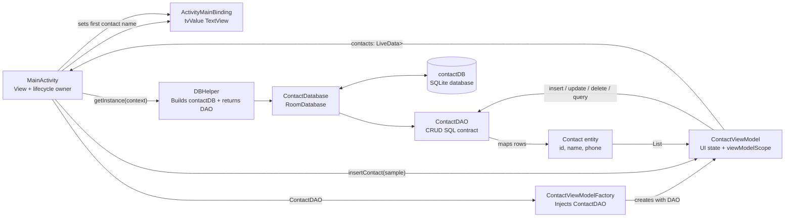
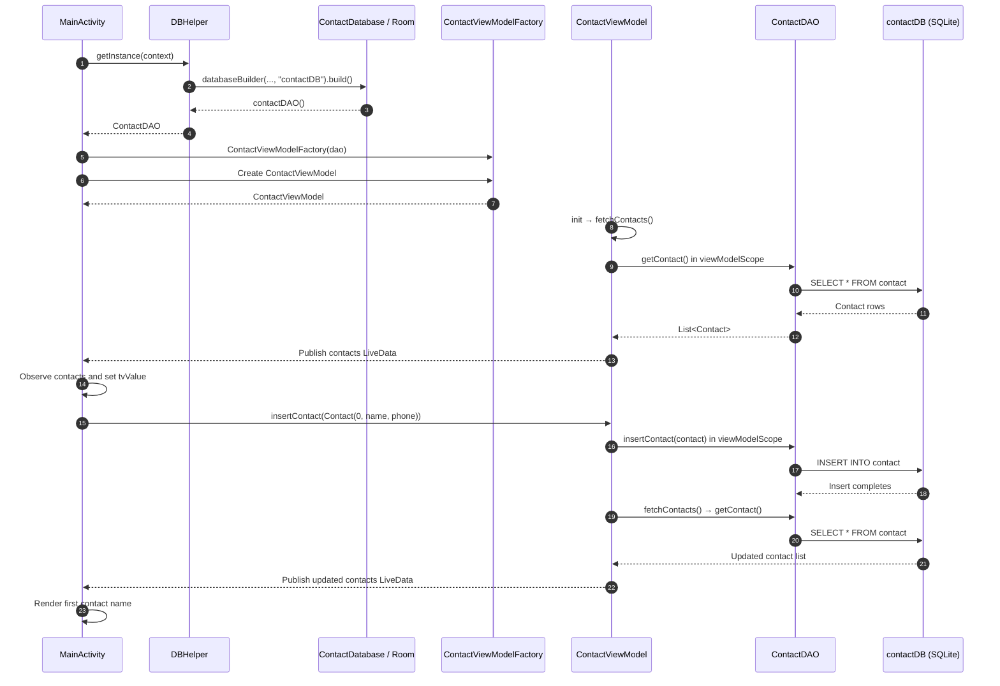
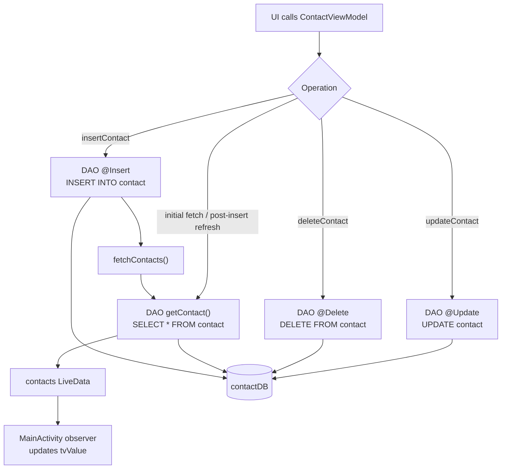

# RoomMVVMBasics

A small Android app demonstrating local contact persistence with Room and the MVVM pattern. On launch, it reads saved contacts, inserts a sample contact, and displays the first contact's name.

## Architecture at a glance



### Layer responsibilities

| Layer | Current class(es) | Responsibility |
| --- | --- | --- |
| View | `MainActivity`, `activity_main.xml` | Creates the database access path, observes contacts, and displays a contact name. |
| Presentation | `ContactViewModel`, `ContactViewModelFactory` | Runs database work in `viewModelScope`, exposes contact state, and receives the injected DAO. |
| Persistence setup | `DBHelper`, `ContactDatabase` | Builds the Room database named `contactDB` and exposes its DAO. |
| Data access | `ContactDAO` | Declares suspend CRUD operations and the SQL query. |
| Data model | `Contact` | Defines the Room entity/table: `id`, `name`, and `phone`. |

> The current project has no repository layer: `ContactViewModel` calls `ContactDAO` directly. That is appropriate for this focused Room example; introduce a repository when multiple data sources or shared data rules are added.

## App-start and insert flow



## CRUD flows



## Project map

```text
app/src/main/java/com/projects/roombasics/
├── MainActivity.kt               # View setup, observer, sample insertion
├── ContactViewModel.kt           # Contact state and coroutine-backed CRUD calls
├── ContactViewModelFactory.kt    # Injects ContactDAO into the ViewModel
├── DBHelper.kt                   # Creates Room and provides ContactDAO
├── ContactDatabase.kt            # Room database definition
├── ContactDAO.kt                 # DAO CRUD methods and SELECT query
└── Contact.kt                    # Room entity/table model
```

## Database reference

```text
Database: contactDB
Table:    contact

contact
├── id: Long       (primary key, auto-generated)
├── name: String
└── phone: String
```

The insert currently supplies `id = 0`; because the key is auto-generated, Room assigns the stored contact ID.

## Notes for future changes

- `contacts[0]` assumes the database contains at least one item. Safely handle an empty list before rendering the first name.
- `getContact()` returns a one-time `List<Contact>`. Returning `LiveData<List<Contact>>` or `Flow<List<Contact>>` from the DAO would let Room automatically notify the UI after all writes, including update and delete.
- Only insertion refreshes the list in the current code. Refresh after update and delete too, or adopt an observable DAO query.
- Prefer a single database instance (for example, held as a singleton) rather than rebuilding it from `DBHelper.getInstance()` on each Activity creation.
- Add a repository layer when the app needs multiple data sources, caching rules, or easier unit testing.
